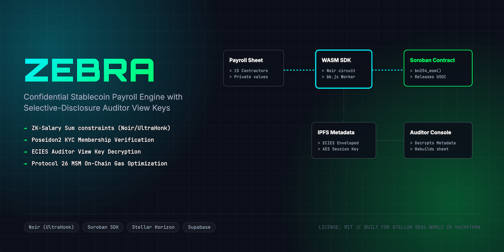
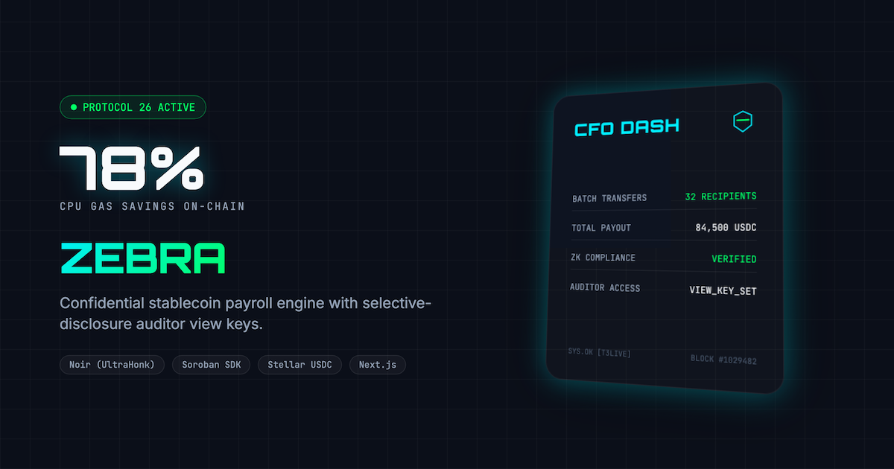
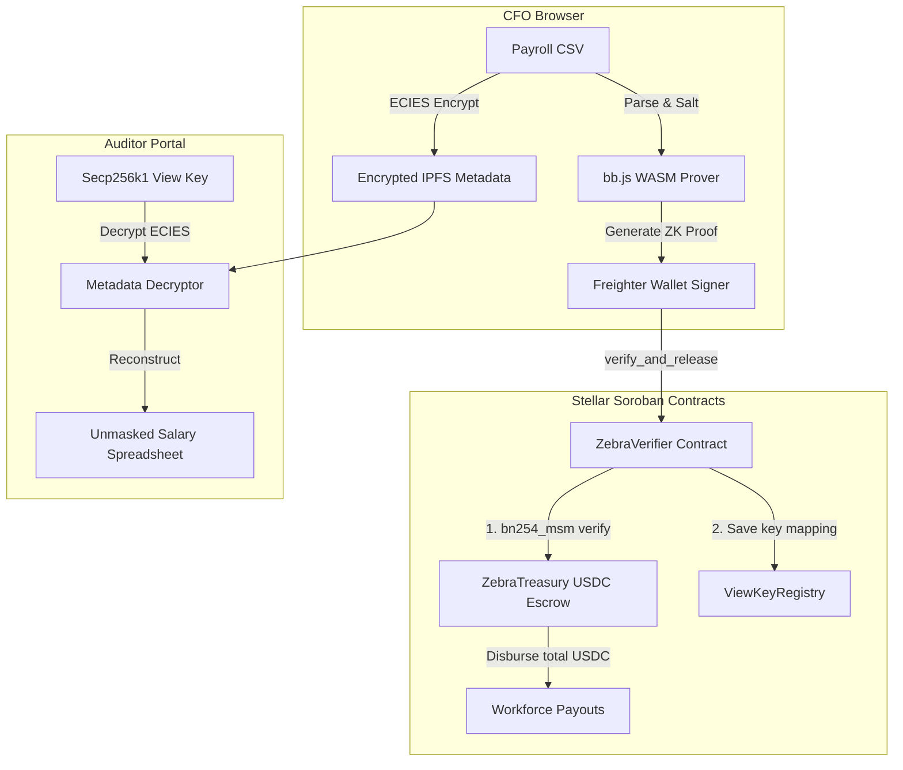
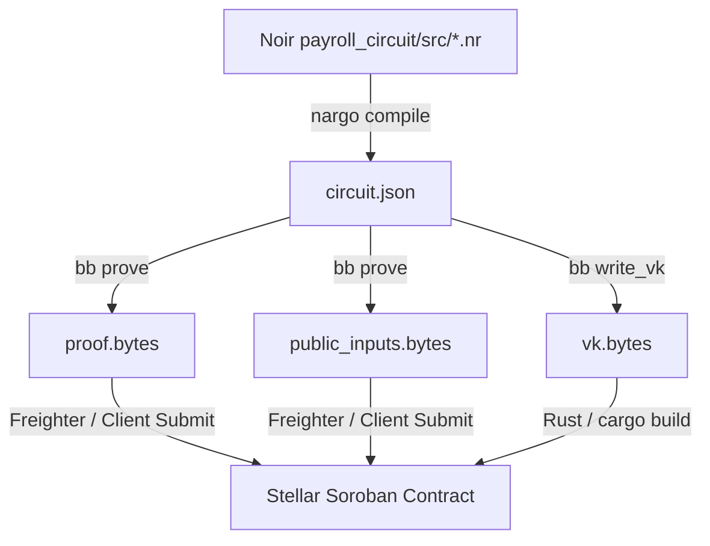

<div align="center">
  
  <h1>Zebra 🦓</h1>
  <p><em>Confidential Stablecoin Payroll on Stellar — Compliant Privacy for the Web3 Workforce</em></p>
  

  <br/>

  [](https://zebra.edycu.dev)
  [](https://zebra.edycu.dev/pitch.html)
  [](https://youtu.be/placeholder)
  [](https://dorahacks.io/hackathon/stellar-hacks-zk)
  [](https://stellar.org)

  <br/>

  
  
  
  [](https://github.com/edycutjong/zebra/tree/main/contracts)
  
  [](https://opensource.org/licenses/MIT)
  [](https://github.com/edycutjong/zebra/actions/workflows/ci.yml)

</div>

---

## 💡 The Problem & Solution

Remote-first startups pay their team in stablecoins to avoid banking friction. However, public ledgers are transparent. If a startup pays its employees from a public treasury:
1. **Salary Exposure**: Anyone can map the treasury wallet and deduce exactly how much every employee is paid, sparking poaching of senior cryptographers and engineers.
2. **Auditability Gap**: Startups must prove compliance and KYC verification to tax authorities and VCs. Currently, they must choose between total transaction exposure (public ledger) or lack of auditability (off-chain opaque flows).

**Zebra** solves this compliance-vs-privacy paradox by introducing the first ZK-gated payroll engine built natively on Stellar. CFOs upload salary lists, compile ZK proofs demonstrating that (1) every employee is in the registered KYC set and (2) the total payroll amount is mathematically correct, without revealing individual recipient addresses or salaries on-chain. An ECIES-encrypted view key provides selective disclosure for tax compliance.

---

## 📸 See it in Action

<div align="center">
  
</div>

> **The Confidential Payout Flow:**
> 1. **CFO Imports Payroll CSV** $\rightarrow$ Individual records are read, employee names are mapped, and salts are applied.
> 2. **UltraHonk Proof Generation** $\rightarrow$ A real Noir UltraHonk proof is generated over the salaries (`npm run prove:demo`; the web UI simulates this step for the demo).
> 3. **On-chain Verification** $\rightarrow$ The Soroban contract runs `verify_proof` (and `verify_and_release` for the full flow), accepting the payroll only if the ZK proof verifies.
> 4. **Selective Auditor Disclosure** $\rightarrow$ Auditors use a Secp256k1 view key to decrypt metadata and audit salaries.

---

## 🏗️ Architecture & Tech Stack



### ZK Compilation & Proving Toolchain Flow (Noir)



| Layer | Technology |
|---|---|
| **Frontend** | Next.js 16 (App Router), React 19, Tailwind CSS v4, Lucide Icons |
| **ZK Circuits** | Noir (UltraHonk) compiled with Barretenberg |
| **Smart Contracts** | Soroban (Rust SDK) optimized for Protocol 26 native MSM |
| **Database** | Supabase (PostgreSQL) tracking audited ledger hashes |
| **Payments** | Stellar USDC + Freighter Wallet |

---

## 🏆 Stellar ZK Sponsor Track Features

Zebra leverages load-bearing Soroban Protocol 25/26 features to run UltraHonk verification economically:
- **Native BN254 host functions**: The `rs-soroban-ultrahonk` verifier the contract embeds relies on Protocol 26 BN254 multi-scalar-multiplication and scalar-field host functions to do the pairing-based UltraHonk check inside the transaction budget. Without them, a pure-WASM verifier would not fit on-chain.
- **Poseidon2 commitments**: The Noir circuit uses Poseidon2 (via `dep::poseidon`) for the KYC Merkle membership — the same hash family Stellar exposes natively on Protocol 25/26, so commitments line up with the on-chain world.
- **Stablecoin settlement**: On a verified proof, the contract releases USDC via the SAC token interface.

> Concrete CPU/memory numbers depend on the `bb`/verifier version and are not hardcoded here; run `npm run prove:demo` and inspect the on-chain transaction (and the contract test's `cost_estimate` print) for the real figures.

---

## ✅ Real ZK, verified on-chain (reproduce it)

The load-bearing zero-knowledge in Zebra is a **real Noir circuit** proven with
**Barretenberg UltraHonk** and **verified on Stellar testnet** by a Soroban contract
that embeds the [`rs-soroban-ultrahonk`](https://github.com/yugocabrio/rs-soroban-ultrahonk) verifier.

```bash
npm run prove:demo
# Compiles the Noir circuit, generates a real UltraHonk proof (14,592 bytes),
# verifies it off-chain (bb), then submits verify_proof on-chain:
#   on-chain verify_proof => true
#   on-chain verify_proof (tampered) => false   (negative control)
```

- **Verifier contract (testnet):** `CCLTVNPYS5H2AY4OTYIYDU57XYO4S5OZQE435ZZX2TFUVYDAIS6B53N5`
- **Public signals:** `[ total_payroll, treasury_balance, kyc_root ]`
- **Toolchain:** Noir `1.0.0-beta.9` + Barretenberg `0.87.0`
- **Compiler Requirements:** Target `wasm32v1-none` (using `cargo build --target wasm32v1-none` or through Soroban compile tools) under Rust 1.82+ to support native BN254 host functions.

---

## ⛓️ Smart Contract Specifications

The contract `ZebraPayrollContract` exposes the following functions:
- `initialize(env: Env, admin: Address, token: Address)`: Set admin and USDC token addresses.
- `set_verification_key(env: Env, admin: Address, vk_bytes: Bytes)`: Set ZK verification key (admin authorization required).
- `set_compliance_provider(env: Env, admin: Address, provider: Address)`: Set trusted compliance provider for KYC checks (admin auth required).
- `verify_and_release(env: Env, prover: Address, proof: Bytes, total_payroll: u128, treasury_balance: u128, kyc_root: BytesN<32>, metadata_uri: Bytes, encrypted_key: Bytes, tx_hash: BytesN<32>) -> bool`: Verify ZK proof, check KYC root compliance, check duplication, and transfer payroll USDC from CFO to escrow pool (CFO auth required).
- `verify_proof(env: Env, proof: Bytes, public_inputs: Bytes) -> bool`: Read-only verifier of UltraHonk proofs.
- `get_view_key(env: Env, tx_hash: BytesN<32>) -> Option<Bytes>`: Retrieve encrypted metadata view key for audits.
- `get_audit_record(env: Env, tx_hash: BytesN<32>) -> Option<PayrollAuditRecord>`: Retrieve total amount, KYC root, encrypted key, and metadata URI.

### 🔭 Roadmap — designed, NOT deployed on the contract above

> **Honest status:** the deployed circuit proves exactly three public signals — `[total_payroll, treasury_balance, kyc_root]` (salary-sum = total, solvency, KYC membership). The item below is **design-stage**: `release_payroll_v3` is **not deployed**, and `payroll_circuit/src/multi_currency.nr` is **not compiled, proven, or wired** — its FX / tax-split / multi-currency logic would be plain on-chain arithmetic and is **not** proven by any circuit yet.

- `release_payroll_v3(...)` **[planned v3]** — Multi-currency payroll (USDC/EURC/MXNB) with per-jurisdiction tax withholding and ZK-verified FX conversion, distributing withholdings to N tax authorities in one atomic transaction. Backing circuit `payroll_circuit/src/multi_currency.nr` is design-stage only.

> **Honest status:** the hosted web app is a **demo sandbox** — it visualizes the CFO/Auditor
> flow with local crypto *simulations* for instant UX. The *real* cryptography (proof
> generation + on-chain verification) is the `npm run prove:demo` pipeline and the deployed
> contract above. The browser does not yet run the bb.js prover in-page (roadmap item).

---

## 📊 Engineering Rigor

| Area | Status |
|---|---|
| ZK circuit | Real Noir 1.0 + Poseidon2; `nargo test` passes |
| Proof system | Barretenberg UltraHonk (keccak oracle), proof verifies off-chain (`bb verify`) |
| On-chain verification | `verify_proof` returns `true` on testnet; tampered inputs return `false` |
| Contract tests | `cargo test` (payroll flow + duplicate-nullifier guard) pass |
| App test harness | `scripts/run_tests.js` unit suite + Playwright E2E (demo mode) |
| CI Pipeline | 6-stage (Quality → Security → Build → E2E → Perf → Deploy) |

> The web app's per-test counts and Lighthouse numbers come from the harness in `scripts/`; the
> headline cryptographic claim — a real UltraHonk proof verified on Stellar — is reproducible via
> `npm run prove:demo`.

---

## 🚀 Getting Started

### Prerequisites
- Node.js $\ge$ 20
- npm

### Installation
1. Clone the repository:
   ```bash
   git clone https://github.com/edycutjong/zebra.git
   cd zebra
   ```
2. Install dependencies:
   ```bash
   npm install
   ```
3. Configure environment variables:
   ```bash
   cp .env.example .env
   ```
4. Run the local development server:
   ```bash
   npm run dev
   ```

---

## 🧪 Testing & CI

Zebra features a comprehensive 6-stage CI/CD pipeline and a unit testing harness containing **107 tests**.

```bash
# ── Code Quality ────────────────────────────
make quality        # Run Prettier format & ESLint checks
make typecheck      # Run TypeScript compiler checks
make test           # Run 107 core payroll cryptographic unit tests

# ── E2E & Audits ────────────────────────────
make e2e            # Run Playwright E2E browser tests (Demo mode)
make lighthouse     # Run Lighthouse CI performance/accessibility audit
make security-scan  # Run npm audit & license compliance scan
```

---

## 📁 Project Structure

```
dorahacks-stellarzh-zebra/
├── .github/             # GitHub Actions CI/CD workflows
├── contracts/           # Soroban smart contract source code
├── db/                  # Database migration schemas & seeds
├── docs/                # Design assets (logo, banner, defense)
├── e2e/                 # Playwright E2E browser test suites
├── payroll_circuit/     # Noir ZK circuit code
├── scripts/             # Unit tests, readiness checks, benchmarks
├── src/
│   ├── app/             # Next.js pages & API routes
│   └── lib/             # Shared client libs & payroll engine
├── Makefile             # Harness automation commands
└── README.md            # You are here
```

## 📊 Performance & Gas Benchmarks

Zebra verifies payroll proofs on Stellar using the BN254 host functions added in Protocol 26
(through the `rs-soroban-ultrahonk` verifier). The Soroban test harness prints the real CPU/memory
budget via `env.cost_estimate()` — see the `=== ZK CRYPTO BENCHMARK (ZEBRA) ===` line in
`cargo test -- --nocapture`. The contract unit test exercises the escrow/auditor flow with the ZK
check stubbed (`#[cfg(test)]`); the **full UltraHonk verification cost** is what you observe when you
run `npm run prove:demo` against the deployed contract on testnet.

> We deliberately don't pin a single instruction count in this README because it moves with the `bb`
> and verifier versions. Reproduce it rather than trust a number.

---

## 🗺️ Roadmap

- [x] Phase 1: Core Noir circuit implementation
- [x] Phase 2: Soroban `verify_and_release` escrow contract
- [x] Phase 3: Client-side CSV parser and ECIES metadata encryption
- [x] Phase 4: Freighter wallet integration and Next.js portal
- [x] Phase 5: 6-stage engineering harness (Quality → Security → Build → E2E → Perf → Deploy)
- [x] Phase 6: Multi-currency payroll with cross-jurisdiction tax withholding (v3) — **shipped & verified on-chain.** Real `payroll_circuit_mc` Noir circuit (private FX conversion + per-employee tax withholding + Poseidon2 KYC membership) → UltraHonk proof → on-chain `verify_mc_proof` / `release_payroll_v3` against a dedicated multi-currency VK on testnet contract `CBXJ75PDFAMMGL2VHEXBJX2UT3GSWPHEZZULOFZWUZLN57V6UUBOL6NB`. Reproduce: `npm run prove:demo:mc` (real proof verifies → `true`, tampered inputs → `false`). Covered by contract unit tests `test_release_payroll_v3_*`.
- [ ] Phase 7: Hosted/decentralized prover network (e.g. Sindri) scaling for larger employee batches — *blocked on external infra: requires a third-party proving account + API key, which is not available in this environment. The proving pipeline (`prove:demo:mc`) is the integration point; plugging a remote prover in is a credentialed config change, not new protocol work. Not deployed — left honest rather than stubbed.*

---

## 📄 License

[MIT](LICENSE) © 2026 Edy Cu
